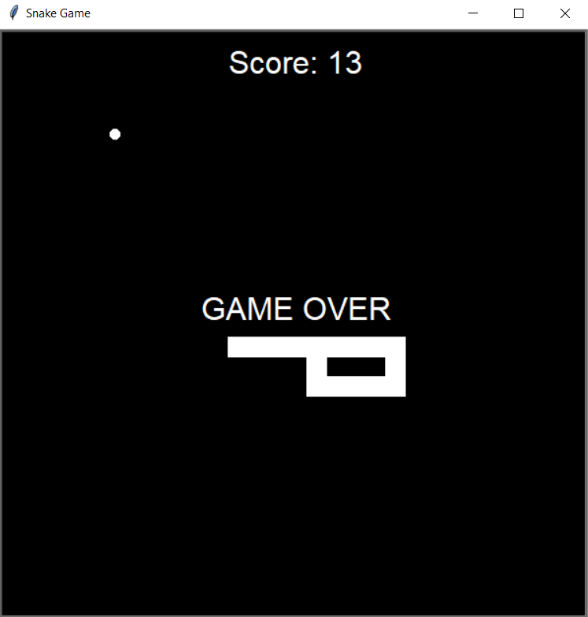

# Snake Game

A video Game genre game. The player controls the snake with arrows ( up ↑, down ↓, left ←, right → ). As the snake moves forward it leaves a trail behind.
Every time the snake hits the food (circle) its tail grows bigger. The player loses when the snake hits the screen border or hits its own tail.

